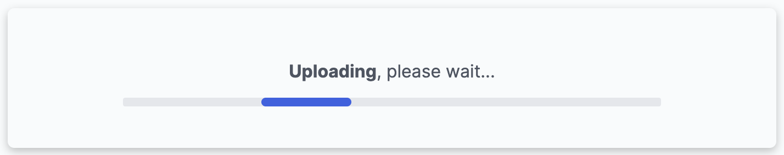
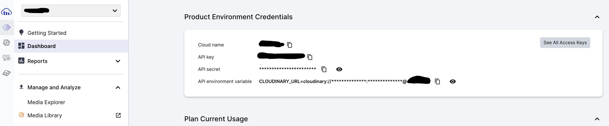

# Simple Image Uploader

The website in the light mode


The website in the dark mode, after an image was successfully uploaded


## Welcome! 👋

**Simple Image Uploader** is a full-stack coding challenge in [devChallenges](https://devchallenges.io/) platform which helps improve coding skills by building realistic projects.

## The challenge

The **Simple Image Uploader** has the following function:

- **Switching modes** - Users can switch between dark and light mode.

- **Uploading images**

  - Users can upload an image at a time with a maximum size of 2MB.
  - Users can drag and drop or select a file in the folder to upload.
  - A loading bar shows when the image is uploading.
  - When the image is successfully uploaded, users can see the image.

- **Share & Download**
  - Share - After the image is uploaded, users can copy its address by selecting the `Share` button
  - Download - users can download the image by selecting the `Download` button

## Applied Skills

#### Server (Backend)

- Node.js and Express
- Cloudinary (for image upload, storage, and download)

#### Client (Frontend)

- React
- Tailwind CSS
- Vite
- Axios (making HTTP requests to the server)
- react-dropzone (for file uploads)
- react-toastify (for displaying notifications)

## Run Locally

Clone the repository, and start the backend and frontend in seperate terminals.

Start the backend:

```bash
cd server
npm install
npm run dev
```

Start the frontend:

```bash
cd ../client
npm install
npm run dev
```

## Experience Sharing

#### The content

- [Initialize the Repository](#initialize-the-repository)
- [Tailwind CSS](#tailwind-css)
- [react-dropzone](#react-dropzone)
- [Cloudinary](#cloudinary)
- [Deployment](#deployment)

### Initialize the Repository

I initialized the fullstack repository based on the [Techtonica curriculum](https://github.com/Techtonica/curriculum/blob/main/pair-programming/week-7/react-express-app/react-expressjs.md), which can be summarized in the following steps:

#### (1) Create a repository

```bash
mkdir simple-image-uploader && cd simple-image-uploader
```

#### (2) Create and initialize the backend

_a. Initialize a new Node.js project_

```bash
mkdir server && cd server
touch index.js

npm init -y
npm install express nodemon
```

_b. Add the following line in the *package.json*_

```json
"scripts": {
  "start": "node index.js",
  "dev": "nodemon index.js"
}
```

_c. Start an express server in *index.js*_

```js
import express from "express";

const app = express();

//Set the port that you want the server to run on
const PORT = process.env.PORT || 5000;

//creates an endpoint for the route /api
app.get("/api", (req, res) => {
  res.status(200).json({ message: "Backend is running!" });
});

// console.log that your server is up and running
app.listen(PORT, () => {
  console.log(`Server listening on ${PORT}`);
});
```

_d. Test the server by [REST Client](https://marketplace.visualstudio.com/items?itemName=humao.rest-client) or [Postman](https://www.postman.com/)_

**REST Client** is a VS code plugin used to send HTTP request and view the response in VS code directly. [The post](https://medium.com/bitsrc/vs-codes-rest-client-plugin-is-all-you-need-to-make-api-calls-e9e95fcfd85a) exhaustively introduces how we use it in multiple situations. On the other hand, **Postman** is an application for testing APIs by sending requests and receiving the responses. I think their [documentation](https://learning.postman.com/docs/introduction/overview/) is worth reading.

To make it simple, here we use REST Client to send HTTP requests in the following steps: create a `*.http` or `*.rest` file, write down the HTTP request, and click "Send Request". For example, the following script, if sent, will be transmitted to the localhost:5000, which then returns `{ message: "Backend is running!" }` back if the server is operating normally.

```http
GET http://localhost:5000/ HTTP/1.1
```

#### (3) Create and intiate the frontend using [Vite](https://vitejs.dev/guide/)

Vite is a frontend dev tool that supports multiple frontend framework, such as Vue and React. I chose to use it because it has gained increasing popularity in recent years, with current weekly downloads reaching over 10 million (2024.02).

```bash
cd ../server
npm create vite@latest client -- --template react

cd client
npm install
npm run dev
```

### Tailwind CSS

[Tailwind CSS](https://tailwindcss.com/) is a really popular CSS framework, which has up to about 8 million weekly downloads (2024.02) and the number seens to grow higher. As a beginner of Tailwind, I used it not only for popularity but [its convenience](https://cult.honeypot.io/reads/tailwind-css-advantages-in-2023/). The following are some of my learnings in this project.

#### (1) Preparatory work

Install the related libraries

```bash
npm install -D tailwindcss
npx tailwindcss init
```

Create two CSS files _input.css_ and _output.css_ under the _src/_ folder, and add the Tailwind directives in the _input.css_.

```css
@tailwind base;
@tailwind components;
@tailwind utilities;
```

Add the command in the _package.json_, then run `npm run css`, which then scan the template files for classes and build our CSS into _output.css_.

```json
"script": {
  "css": "npx tailwindcss -i ./src/input.css -o ./src/output.css --watch",
}
```

Add the link to _output.css_ in the head section in _index.html_

```html
<link href="./src/output.css" rel="stylesheet" />
```

Lastly, don't forget to remove `import "index.css"` in _main.jsx_.

#### (2) Basics

We can directly add the classes, which were pre-defined in Tailwind, in the html elements to style them. These classes are logically named and are sufficient for us to create a simple looking frontend. I checked [their documentation](https://tailwindcss.com/docs/installation) every time in the beginning but the rules are easily remembered.

For example, consider styling an element in Tailwind as follows: the element functions as a container with a flex-box (`flex`) arranged in a row direction (`flex-row`) and has a left margin equal to 6% of its container (`ml-[6%]`). The spacing between adjacent elements is set to 20px (`gap-5`).

```html
<div className="flex flex-row gap-5 ml-[6%]"></div>
```

#### (3) Customization

The styles can be costomized either <u>in the html elements</u> or <u>in the _tailwind.config.js_ file</u>.

We use `[]` to specify the value of a style in a html element. for example: bg-[#f061FF], ml-[6%], text-[2.1rem]. This method is often recommended only if the value is used only once on a page.

When customizing in _tailwind.config.js_, tailwind provides two ways, either <u>extending the default value</u> or <u>replacing it entirely</u>. The difference is, when you just extending the default value for a property, the other pre-defined values given that property can also be used. However, if you replace it entirely, for that property, you can only use what you have defined.

The follow shows two ways of customizing the background colors. In the first condition, you can still use the other default values like `bg-gray-200` and `bg-red-400`, while both of the two cannot be applied in the second condition if you don't define them.

_a. Extending the default value_

```js
module.exports = {
  theme: {
    extend: {
      backgroundColor: {
        gray: {
          100: "#F9FBFC", // primary-light
          700: "#374254", // mode-dark
          800: "#212936", // card-dark
          900: "#121926", // primary-dark
        },
      },
    },
  },
};
```

_b. Replacing it entirely_

```js
module.exports = {
  theme: {
    backgroundColor: {
      gray: {
        100: "#F9FBFC", // primary-light
        700: "#374254", // mode-dark
        800: "#212936", // card-dark
        900: "#121926", // primary-dark
      },
      // ...
    },
  },
};
```

#### (4) Animation

Tailwind provides animation for html elements, which is useful to create the loading bar in this project.



First, let's extend custom animation in _tailwind.config.js_ using **keyframes** and **animation**. The keyframes section defines a CSS keyframe animation named `loading`. This animation will transition the `left` property of an element from `-100%` to `100%` and back to `-100%`. The animation section associates the keyframe animation named `loading` with a CSS animation named `loading`. This animation has a duration of `3s`, follows a `linear` timing function, and repeats `infinite` times.

The HTML element with class `animation-loading` will undergo the sliding animation.

```js
export default {
  theme: {
    extend: {
      keyframes: {
        loading: {
          "0%": { left: "-100%" },
          "50%": { left: "100%" },
          "100%": { left: "-100%" },
        },
      },
      animation: {
        loading: "loading 3s linear infinite",
      },
    },
  },
};
```

Next, the loading bar is defined as follows: The element with `id="progress"` will smoothly transition left and right. The container is applied with `overflow-hidden` to conceal the moving element if it exceeds the container's range.

```js
<div className="relative h-2 w-[70%] bg-gray-200 rounded-sm overflow-hidden">
<div
  id="progress"
  className="absolute h-full w-1/6 rounded-full bg-blue-500 animate-loading"
></div>
```

#### (5) Light and dark mode

Offering a dark mode in a website is an expected feature nowadays. Fortunately, tt is easy to switching between light and dark mode using Tailwind CSS.

Just follow the steps!

_a. Enable dark mode_

Include `darkMode` in _tailwind.config.js_. Set it to `"class"` for manual or user-controlled mode switching. Choose `"media"` to automatically adjust between dark and light modes based on the browser's color scheme preference.

```js
module.exports = {
  darkMode: "class", // or "media"
};
```

_b. Mode toggler_

There are various approaches to toggle modes, with a common concept being the addition of the `dark` class to all document elements for dark mode and its removal for light mode. Below is how I've implemented, although I don't know if it is good.

I've created a hook named lightMode, where the dark class is applied when lightMode is set to true and removed otherwise.

```js
const [lightMode, setLightMode] = useState(true);

useEffect(() => {
  if (lightMode) {
    document.documentElement.classList.remove("dark");
  } else {
    document.documentElement.classList.add("dark");
  }
}, [lightMode]);
```

### react-dropzone

[react-dropzone](https://react-dropzone.js.org/) is a react hook to create a HTML5-compliant drag-and-drop zone for multiple files. I used it in this project such that users can <u>drag and drop</u> or <u>select a file in the folder</u> to upload images.

I recommend to read its documentation as it was well written.

_a. Installation_

```bash
npm install --save react-dropzone
```

_b. Usage_

The following is extracted from the [react-dropzone documentation](https://react-dropzone.js.org/).

- `useDropzone` (hook): binds nececcary handlers to create a drag 'n' drop zone
  - `onDrop` (func): provides you with an array of File objects which you can then process and send to a server
  - `accept` (prop): the accepted file types. For example, `"image/png": [".png"]`, `"text/html": [".html", ".htm"]`
- `getRootProps` (func): returns the props you should apply to the root drop container you render
- `getInputProps` (func): returns the props you should apply to hidden file input you render
- `isDragActive` (boolean): if an active drag is in progress

The template:

```js
import React, { useCallback } from "react";
import { useDropzone } from "react-dropzone";

function MyDropzone() {
  const onDrop = useCallback((acceptedFiles) => {
    // Do something with the files
  }, []);
  const { getRootProps, getInputProps, isDragActive } = useDropzone({
    onDrop,
    accept: { "image/*": [] }
  });

  return (
    <div {...getRootProps()}>
      <input {...getInputProps()} />
      {isDragActive ? (
        <p>Drop the files here ...</p>
      ) : (
        <p>Drag 'n' drop some files here, or click to select files</p>
      )}
    </div>
  );
}
```

### Cloudinary

[Cloudinary](https://cloudinary.com/) is an service that provides a cloud space to store images and videos, and its [free plan](https://cloudinary.com/pricing) is sufficient for our personal project.

While Cloudinary offers numerous tutorials, its documentation is somewhat hard to follow. Below, I provide a solution that I pieced together from various sources.

_a. Send image from frontend to backend_

I created a `FormData` object and append the image object (`imgObject`), save name (`saveName`) and folder (`saveFolder`).

```js
const formData = new FormData();
formData.append("file", imgObject);
formData.append("saveName", saveName);
formData.append("saveFolder", saveFolder);
```

Then, send it to the backend via Axios.

```js
const {
  data: { imageUrl },
} = await axios.post(`${config.BASE_URL}/upload_image`, formData);
```

_b. Receive image in backend_

I used _multer_ to handle FormData. _multer_ is a Node.js middleware for handing multipart/form-data, which is a Content-Type that is essential for sending different types of data in a single HTTP POST request.

The `req.file` is an object including the following properties: fieldname, originalname, encoding, mimetype, buffer, and size.

```js
// ...
const storage = multer.memoryStorage();
const upload = multer({ storage: storage });

app.post("/api/upload_image", upload.single("file"), async (req, res) => {
  const imageFile = req.file;
  const { saveName, saveFolder } = req.body;
  // ...
});
```

_c. Create a Cloudinary account_

We should create an account to get the <u>cloud name</u>, <u>api key</u>, and <u>api secret</u>, and use them to upload our image. After signing in, the **Dashboard** shows the three. We save them in the `.env` file.

The **Media Explore** on the left side shows all uploaded images. Let's created a folder named `image-uploader` for future storage.




_d. Upload image to the Cloudinary_

The image should be changed to **dataURI** before uploaded to the Cloudinary. We can obtain it using the `buffer` in the image object.

```js
const base64Image = imageFile.buffer.toString("base64");
const dataUri = `data:${imageFile.mimetype};base64,${base64Image}`;
```

Set the configuration parameters for Cloudinary.

```js
cloudinary.config({
  cloud_name: process.env.CLOUDINARY_CLOUD_NAME,
  api_key: process.env.CLOUDINARY_API_KEY,
  api_secret: process.env.CLOUDINARY_API_SECRET,
});
```

Upload the image by its function. `folder` is where the image is saved, and `public_id` is its name.

```js
const res = await cloudinary.uploader.upload(dataUri, {
  folder: saveFolder,
  public_id: saveName
});
```

### Deployment

Deployment cost me a lot of time as I kept facing some problems: `404 Not Found`, `CORS`, ...

The following lists what you can try to deploy your project, some need paying but I think it is not much:

- [Vercel](https://vercel.com/) - has free plan, but I spend several hours to debug the CORS bug and finally gave up.
- [Deta Space](https://deta.space/) - free, but I think it may take me much time to read the tutorial
- [Render](https://render.com/) - has free plan
- [Heroku](https://www.heroku.com/) - has only paided plan
- [Railway](https://railway.app/) - has only paid plan
- [fly.io](https://fly.io/) - gives you a one-time $5 sign-up credit (you have to firstly enter your credit card number)

Ultimately, I follow the [fly.io documentation](https://fly.io/docs/hands-on/) and successfully deployed. The following are some points that worth mention.

#### (1) Import .env for Deployment

We can add some normal environment variable in the Dockerfile, such as `NODE_ENV` and `FRONTEND_ORIGIN_URL`, but it is typically not recommended to add the sensitive ones, which is in the `.env` file, into the Dockerfile.

fly.io provides the command to import the variables: `fly secrets import`, which, in our case, is

```bash
fly secrets import < .env
```

#### (2) Check the port

Check if the port written in the Dockerfile the same as that in your code.

#### (3) Enable the fontend URL to access

```js
app.use(
  cors({
    origin: process.env.FRONTEND_ORIGIN_URL,
  })
);
```