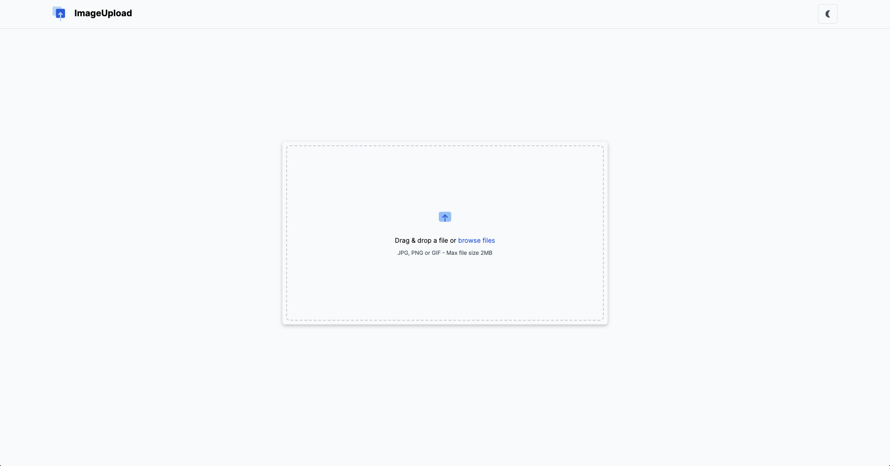
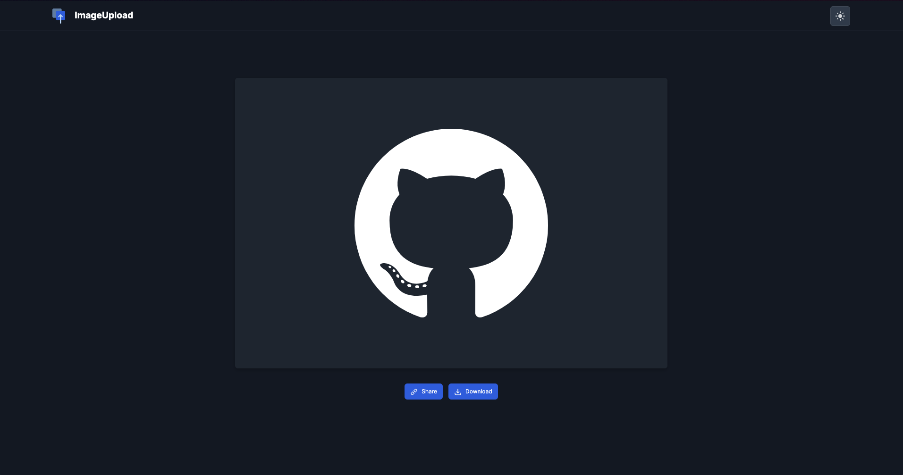

# Simple Image Uploader
The website in the light mode



The website in the dark mode, after an image was successfully uploaded



## Welcome! 👋

**Github Profile** is a front-end coding challenge in [devChallenges](https://devchallenges.io/) platform which helps improve coding skills by building realistic projects.

## The challenge

The **Simple Image Uploader** has the following function:

- **Switching modes** - Users can switch between dark and light mode.

- **Uploading images**
  - Users can upload an image at a time with a maximum size of 2MB.
  - Users can drag and drop or select a file in the folder to upload.
  - A loading bar shows when the image is uploading.
  - When the image is successfully uploaded, users can see the image.

- **Share & Download**
  - Share - After the image is uploaded, users can copy its address by selecting the `Share` button
  - Download - users can download the image by selecting the `Download` button

## Applied Skills

#### Server (Backend)

- Node.js and Express
- Cloudinary (for image upload, storage, and download)

#### Client (Frontend)

- React
- Tailwind CSS
- Vite
- Axios (making HTTP requests to the server)
- react-dropzone (for file uploads)
- react-toastify (for displaying notifications)

## Run Locally

Clone the repository, and start the backend and frontend in seperate terminals.

Start the backend:
```bash
cd server
npm install
npm run dev
```

Start the frontend:
```bash
cd ../client
npm install
npm run dev
```

## Experience Sharing

### Initiate the Repository

I initiated the fullstack repository based on the [Techtonica curriculum](https://github.com/Techtonica/curriculum/blob/main/pair-programming/week-7/react-express-app/react-expressjs.md), which can be summarized in the following steps:

#### (1) Create a repository

```bash
mkdir simple-image-uploader && cd simple-image-uploader
```

#### (2) Create and initiate the backend

a. Initialize a new Node.js project
```bash
mkdir server && cd server
touch index.js

npm init -y
npm install express nodemon
```

b. Add the following line in the *package.json*
```json
"scripts": {
  // ...
  "start": "node index.js",
  "dev": "nodemon index.js"
}
```

c. Start an express server in *index.js*

```js
import express from 'express';

const app = express();

//Set the port that you want the server to run on
const PORT = process.env.PORT || 5000;

//creates an endpoint for the route /api
app.get('/api', (req, res) => {
  res.status(200).json({ message: "Backend is running!" });
});

// console.log that your server is up and running
app.listen(PORT, () => {
  console.log(`Server listening on ${PORT}`);
});
```

d. Test the server by [REST Client](https://marketplace.visualstudio.com/items?itemName=humao.rest-client) or [Postman](https://www.postman.com/)

REST Client is a VS code plugin used to send HTTP request and view the response in VS code directly. The [medium post](https://medium.com/bitsrc/vs-codes-rest-client-plugin-is-all-you-need-to-make-api-calls-e9e95fcfd85a) exhaustively introduced how we use it in multiple situations.

Simply put, create a `*.http` or `*.rest` file, which will be recognized by REST Client to run HTTP requests from this file.

For example, we can add the following command in the file and press "Send Request", then the running server at the port 5000 will receive the GET request and return `{ message: "Backend is running!" }`.

```http
GET http://localhost:5000/ HTTP/1.1
```

#### (3) Create and intiate the frontend using [Vite](https://vitejs.dev/guide/)

```bash
cd ../server
npm create vite@latest client -- --template react

cd client
npm install
npm run dev
```

### Tailwind CSS

[Tailwind CSS](https://tailwindcss.com/) is a really popular CSS framework, which has up to about 8 million weakly downloads (2024.02) and the number seens to [grow higher](https://npmtrends.com/tailwindcss). As a beginner of Tailwind, I used it not only for popularity but [its convenience](https://cult.honeypot.io/reads/tailwind-css-advantages-in-2023/). The following are some of my learnings in this project.

#### (1) Preparatory work

Install the related libraries
```bash
npm install -D tailwindcss
npx tailwindcss init
```

Create two CSS files *input.css* and *output.css* under the *src/* folder, and add the Tailwind directives in the *input.css*.
```css
@tailwind base;
@tailwind components;
@tailwind utilities;
```

Add the command in the *package.json*, then run `npm run css`, which then scan the template files for classes and build our CSS (*output.css*).

```json
"script": {
  // ...
  "css": "npx tailwindcss -i ./src/input.css -o ./src/output.css --watch",
}
```

Add the link to *output.css* in the head section in *index.html*

```html
<link href="./src/output.css" rel="stylesheet" />
```

Lastly, don't forget to remove `import "index.css"` in *main.jsx*.

##### (2) Basics
To be updated...

### react-dropzone
To be updated...

### Cloudinary
To be updated...

### Deployment
To be updated...
